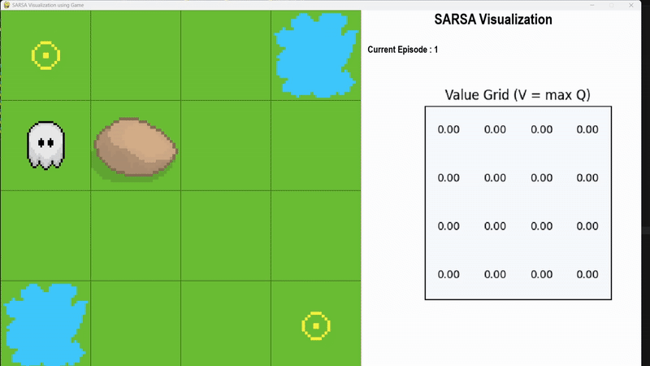
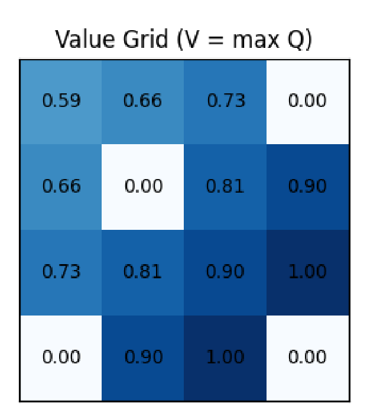

# 🎯 SARSA Visualization: Exploring On-Policy Reinforcement Learning  
*(State-Action-Reward-State-Action in action)*

## Overview  
This project visualizes the workings of the SARSA algorithm — an on-policy temporal-difference learning method — in a simple environment. It lets you watch how an agent learns from the sequence of states and actions, gradually improving its policy and behavior.

## 🎬 Demo  


## 🖼 Visual Snapshot  
  
*A snapshot of the learned policy and Q-value heatmap after training.*

## 🚀 Key Features  
- Implements SARSA in (environment description here)  
- Tracks and plots learning curves (reward vs episode)  
- Visualizes policy as arrows/heatmaps over states  
- Easy to extend to other environments & RL algorithms  

## 🛠 Installation & Usage  
```bash
# Clone repo
git clone https://github.com/RohanMishra101/SARSA_Visualization.git
cd SARSA_Visualization

# (Optionally) create a virtual environment
python -m venv venv
.\\venv\\Scripts\\activate      # on Windows
# or
source venv/bin/activate        # on macOS/Linux

# Install dependencies
pip install -r requirements.txt

# Run the visualization script
python main.py                  # or whichever entry file
